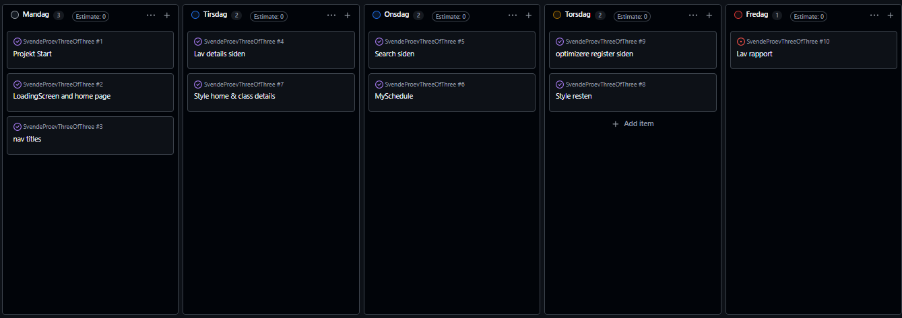

# Svendeprøve

## Rapport

- Sebastian Larsen
- H1WE080125
- [Github Link](https://github.com/BeastTheNinja/SvendeProevThreeOfThree)
- login: brugernavn <info@webudvikler.dk> kode: password

## Indholdsfortegnelse

- [Indledning](#indledning)
- [Vurdering af egen indsats](#vurdering-af-egen-indsats)
- [Redegørelse for kodeelementer](#redegørelse-for-kodeelementer)
- [Fremhævelse af punkter til bedømmelse](#fremhævelse-af-punkter-til-bedømmelse)
- [Bilag: Tidsplan](#bilag-tidsplan)
- [Konklusion](#konklusion)

---

## Indledning

I dette projekt har jeg udviklet en webapplikation til visning og tilmelding til træningshold. Brugeren kan se populære hold, søge efter hold, se detaljer om et bestemt hold samt oprette en bruger og logge ind.

Formålet med applikationen er at gøre det nemt for brugeren at finde relevante hold ud fra navn, dag, tidspunkt eller beskrivelse. En logget ind bruger kan tilføje hold til sit personlige skema og se sine valgte hold på siden “My Schedule”.

Projektet er udviklet med React, TypeScript, React Router og SCSS. Data hentes fra et eksternt API, mens brugerens valgte hold gemmes i browserens localStorage.

---

## Vurdering af egen indsats

Jeg synes, at jeg har arbejdet struktureret med projektet og fået implementeret de vigtigste funktioner. Jeg har især haft fokus på, at applikationen skulle være nem at navigere i, og at brugeren skulle kunne gennemføre de vigtigste handlinger uden unødvendige trin.

En af mine styrker i projektet har været arbejdet med komponenter. Jeg har opdelt applikationen i mindre komponenter som knapper, inputfelter, fejlbeskeder, loading-visninger og holdkort. Det gør koden mere overskuelig og gør det muligt at genbruge funktionalitet flere steder.

Jeg har også arbejdet med validering af login- og registreringsformularer. Brugeren får besked, hvis felter mangler, hvis e-mailadressen ikke er gyldig, eller hvis adgangskoden er for kort.

Det, jeg kunne have arbejdet mere med, er eksempelvis automatiske tests og en mere permanent lagring af brugerens skema. Skemaet gemmes i øjeblikket i localStorage, hvilket fungerer i browseren, men dataene bliver ikke gemt på serveren. Jeg kunne også have brugt mere tid på at finpudse fejltilstande og gøre alle tekster ensartede på samme sprog.

---

## Redegørelse for kodeelementer

Projektet er bygget med React-komponenter. Hver side og funktion er opdelt i selvstændige komponenter. Det gør det lettere at vedligeholde projektet, fordi ændringer kan foretages i en enkelt komponent uden nødvendigvis at påvirke resten af applikationen.

Routing er samlet i router.tsx. Her defineres projektets sider, blandt andet /home, /search, /login, /register og /mySchedule. Ruten til skemaet er beskyttet af komponenten ProtectedRoute, så kun brugere, der er logget ind, kan tilgå den.

I api.ts findes en fælles funktion til kommunikation med backend. Funktionen modtager et endpoint og eventuelle request-informationer. Den tilføjer automatisk Content-Type og brugerens access token fra cookies som en Bearer-token. På den måde bliver API-kald håndteret ensartet fra resten af applikationen.

Jeg har lavet et generisk custom hook kaldet useFetch i useFetch.ts. Hooket håndterer data, loading og fejl ved API-kald. Det bruges blandt andet på forsiden og søgesiden. Fordelen ved hooket er, at den samme logik ikke behøver at blive skrevet flere gange.

Login og registrering håndteres i Login.tsx og Register.tsx. Formularerne bruger custom hooket useForm, som samler formularværdier, ændringer og valideringsfejl. Når login lykkes, gemmes tokens i cookies, og brugeren sendes videre til den relevante side.

På forsiden i Home.tsx hentes alle hold fra API’et. Et hold udvælges som fremhævet hold, og de øvrige hold vises gennem komponenten TeamSlider. På den måde bliver dataene fra API’et vist i genanvendelige UI-komponenter.

Søgefunktionen ligger i Search.tsx. Her bruges useSearch til at filtrere hold baseret på blandt andet navn, dag, tidspunkt, beskrivelse og trænerens navn. Resultaterne kan desuden sorteres efter navn, dag eller tidspunkt. Søgeordet gemmes i URL’en som parameteren q, så søgningen kan deles eller genindlæses uden at blive nulstillet.

På siden ClassDetails.tsx kan brugeren se detaljer om et bestemt hold. Hvis brugeren ikke er logget ind, bliver brugeren sendt til login. Efter login kan brugeren tilføje holdet til sit skema. Før holdet tilføjes, kontrolleres det, om det allerede findes i skemaet.

Siden Schedule.tsx læser brugerens valgte hold fra localStorage og viser dag, tidspunkt og holdnavn. Hvis der ikke er valgt nogen hold, vises en besked til brugeren.

Stylingen er lavet med SCSS-moduler. Det betyder, at CSS-klasserne er lokale for den enkelte komponent eller side. Dette mindsker risikoen for navnekonflikter og gør det lettere at organisere projektets styling.

---

## Fremhævelse af punkter til bedømmelse

Jeg vil især fremhæve følgende dele af projektet:

- Genanvendelige React-komponenter.
- TypeScript-typer til hold, brugere og skemaer.
- Custom hooks til formularer, API-kald, søgning og sortering.
- Login og registrering med validering.
- Beskyttede routes, hvor login er nødvendigt.
- Dynamisk søgning og sortering af hold.
- Håndtering af loading- og fejltilstande.
- Responsivt layout med SCSS.
- Brug af cookies til tokens og localStorage til det personlige skema.

---

## Bilag: Tidsplan

---

## Konklusion

Jeg har udviklet en fungerende webapplikation, hvor brugeren kan finde træningshold, se information om holdene og gemme dem i et personligt skema. Projektet demonstrerer brug af React, TypeScript, routing, API-integration, formularvalidering, cookies og localStorage.

Arbejdet har givet mig erfaring med at opdele en større applikation i mindre komponenter og med at håndtere forskellige brugerflows. Jeg er tilfreds med resultatet, men projektet kunne videreudvikles med serverbaseret lagring af skemaet, automatiske tests og flere funktioner til brugerens profil.
